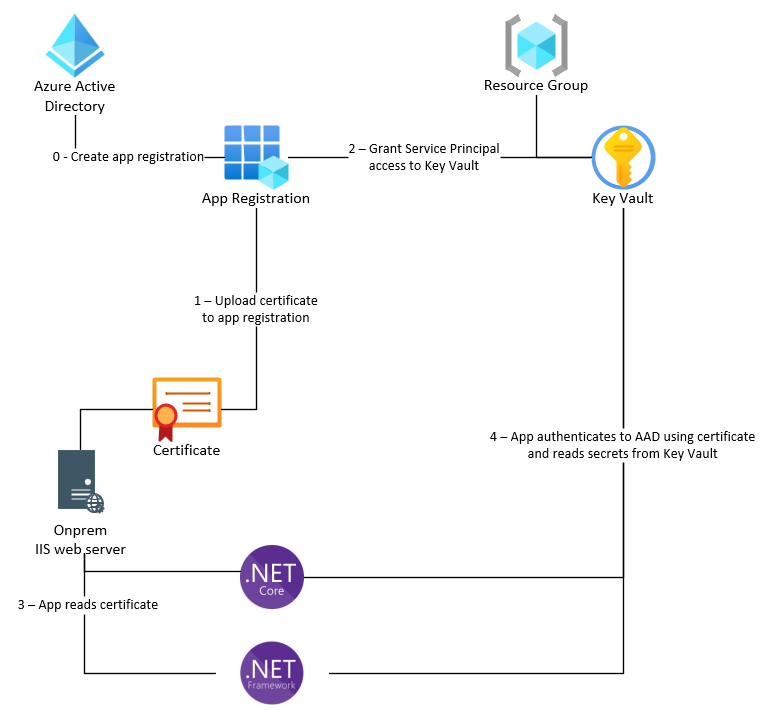

# keyvault-web

This repo shows how to retrieve secrets stored in an Azure Key Vault using a .NET Framework & .NET Core application. It demonstrates both pulling the secrets via middleware at startup time and dynamically when a page is loaded.

## Onprem deployment



Onprem, you need to provide a way for the running application to access the Key Vault securly. This is accomplished via service principal provisioned in Azure Active Directory. This service principal is then granted access to the Key Vault. The application authenticates to Azure Active Directory using a X.509 certificate so that it can use the service principal to access the Key Vault.

## Azure deployment


In Azure, the process can be simplified by using a Managed Identity. The Managed Identity is granted access to the Key Vault & is assigned to the App Service so code running in the App Service can use it. The deployment script will set the Managed Identity client ID for you as part of deployment. This will override the values specified in the configuration files.

**Note**: This repo intentionally doesn't access the secrets through the Azure App Service configuration so that it is portable between onprem & Azure. If you are only targeting Azure, you can store the secrets in the [App Service configuration](https://docs.microsoft.com/en-us/azure/app-service/app-service-key-vault-references?tabs=azure-cli).

**Note**: You could still use the [certificate-based authentication](https://docs.microsoft.com/en-us/azure/app-service/configure-ssl-certificate?tabs=apex%2Cportal) method to allow your application to authenticate with Azure AD instead of using Managed Identity. Managed Identity makes the process simpler, but is not required.

## Disclaimer

**THE SOFTWARE IS PROVIDED "AS IS", WITHOUT WARRANTY OF ANY KIND, EXPRESS OR IMPLIED, INCLUDING BUT NOT LIMITED TO THE WARRANTIES OF MERCHANTABILITY, FITNESS FOR A PARTICULAR PURPOSE AND NONINFRINGEMENT. IN NO EVENT SHALL THE AUTHORS OR COPYRIGHT HOLDERS BE LIABLE FOR ANY CLAIM, DAMAGES OR OTHER LIABILITY, WHETHER IN AN ACTION OF CONTRACT, TORT OR OTHERWISE, ARISING FROM, OUT OF OR IN CONNECTION WITH THE SOFTWARE OR THE USE OR OTHER DEALINGS IN THE SOFTWARE.**

## .NET Framework

The .NET Framework version of this application pulls the secrets from Key Vault when the web page is loaded. It does not have a middleware that pulls the secrets at startup time. You can install a common middleware like [OWIN](https://docs.microsoft.com/en-us/aspnet/aspnet/overview/owin-and-katana/) to provide a middleware, but this is not required. If you install & use OWIN, you can add similar code in the Startup.cs file to pull the secrets at startup time.

The following NuGet packages are required to access Key Vault using .NET Framework (these will install some additional dependencies):

- Azure.Identity
- Azure.Security.KeyVault.Secrets

If you look at the `./web-net-framework/Web.config` file, you can see the following app settings which will allow the application to authenticate with Azure Active Directory so it can use the service principal to access the Key Vault.

```xml
<appSettings>
  ...
  <add key="KeyVaultName" value="kv-keyvault-web-ussc-dev" />
  <add key="Authentication:AzureADApplicationId" value="9bfd1049-3cfe-4466-a684-2b5fb636b03e" />
  <add key="Authentication:AzureADCertificateThumbprint" value="A17D4362FBF40049BB4AA7EB465D082358C7878A" />
  <add key="Authentication:AzureADDirectoryId" value="72f988bf-86f1-41af-91ab-2d7cd011db47" />
  <add key="Authentication:ManagedIdentityClientId" value="" />
  <add key="IsHostedOnPrem" value="true" />
</appSettings>
```

### Onprem authentication with certificate

In the `./web-net-framework/Controllers/HomeController.cs`, we pull the certificate from the local store, authenticate with Azure AD, then pull the secrets that are needed.

```cs
string keyVaultName = ConfigurationManager.AppSettings["KeyVaultName"];
var kvUri = "https://" + keyVaultName + ".vault.azure.net";

SecretClient client = null;

var x509Store = new X509Store(StoreName.My,
                      StoreLocation.LocalMachine);

x509Store.Open(OpenFlags.ReadOnly);

X509Certificate2 x509Certificate;

// Get the certificate from the store based upon the thumbprint
x509Certificate = x509Store.Certificates.Find(X509FindType.FindByThumbprint,
                                              ConfigurationManager.AppSettings["Authentication:AzureADCertificateThumbprint"],
                                              validOnly: false)
                                        .OfType<X509Certificate2>()
                                        .Single();

// Authenticate with Azure AD, passing in the certificate & indicating with service principal to authenticate with (specified via the AzureADApplicationId)
client = new SecretClient(new Uri(kvUri),
                              new ClientCertificateCredential(
                                ConfigurationManager.AppSettings["Authentication:AzureADDirectoryId"],
                                ConfigurationManager.AppSettings["Authentication:AzureADApplicationId"],
                                x509Certificate));

// Get the secrets
theKingOfAustriaSecret = await client.GetSecretAsync("the-king-of-austria");
```

### App Service with Managed Identity

Using the Managed Identity associated with the App Service, it much simpler to authenticate with Azure AD.

```cs
 client = new SecretClient(new Uri(kvUri),
                            new DefaultAzureCredential(new DefaultAzureCredentialOptions
                            {
                                ManagedIdentityClientId = ConfigurationManager.AppSettings["Authentication:ManagedIdentityClientId"]
                            }));
```

## .NET Core

Similarly, the .NET Core version of this application pulls the Key Vault secrets when the web page is loaded. However, because .NET Core already has a middleware installed, most of the secrets are pulled at startup time. Only 1 secret is pulled at page load time to demonstrate how to pull secrets dynamically.

If you look at the `./web-net-core/appsettings.json` file, you can see the following app settings which will allow the application to authenticate with Azure Active Directory so it can use the service principal to access the Key Vault.

```json
"KeyVaultName": "kv-keyvault-web-ussc-dev",
"Authentication": {
  "AzureADApplicationId": "9bfd1049-3cfe-4466-a684-2b5fb636b03e",
  "AzureADCertificateThumbprint": "539cd5afadb7b25b85cf90a78c261074a6db6445",
  "AzureADDirectoryId": "72f988bf-86f1-41af-91ab-2d7cd011db47",
  "ManagedIdentityClientId": ""
},
"IsHostedOnPrem": "true"
```

### Startup.cs code to pull all secrets as configuration values

The middleware allows us to pull all secrets from Key Vault at startup time and store them as configuration values that can be used throughout the application (look at the `./web-net-core/Program.cs` file).

```cs
builder.Configuration.AddAzureKeyVault(new Uri(kvUri), new ClientCertificateCredential(
                                          builder.Configuration["Authentication:AzureADDirectoryId"],
                                          builder.Configuration["Authentication:AzureADApplicationId"],
                                          x509Certificate));
```

## Prerequisites

- [Azure CLI](https://docs.microsoft.com/en-us/cli/azure/install-azure-cli)
- [Dotnet CLI](https://docs.microsoft.com/en-us/dotnet/core/tools/)
- [.NET Framework 4.7.2](https://dotnet.microsoft.com/en-us/download/dotnet-framework)
- Azure subscription & resource group
- On-prem server

## Deployment

### Create the certificate

It is recommeded that you get a signed certificate from your company's certificate authority. However, if you cannot, you can generate a self-signed certificate locally.

```shell
./create-certificate.ps1
```

### Create the app registration

### Deploy the infrastructure

```shell
az deployment group create -g rg-keyvault-web-ussc-dev --template-file ./infra/main.bicep --parameters ./infra/env/dev.parameters.json --parameters theKingOfAustriaSecretValue="Joseph the 2nd" theKingOfPrussiaSecretValue="Fredrick Wilhelm the 3rd" theKingOfEnglandSecretValue="Why the tyrant King George, of course!"
```

### Build/publish .NET Framework Web App & deploy to Azure

1.  Update the `./web-net-framework/Web.config` file with the your values.

    - `KeyVaultName` - the name of your Key Vault
    - `Authentication:AzureADApplicationId` - the application ID (client ID) of your service principal
    - `Authentication:AzureADCertificateThumbprint` - the thumbprint of the certificate installed on the machine that will be used to authenticate with Azure Active Directory
    - `Authentication:AzureADDirectoryId` - the tenant ID where your service principal is instantiated

1.  Right-click on the project and select **Build**.

1.  Right-click on the project and select **Publish**.

1.  Click the **New** button.

1.  Select **Azure**, then **Next**. Select **Azure App Service (Windows)**, then **Next**.

1.  Select your **Azure subscription**, **Resource Group** and **App Service instance** (make sure and select the **wa-net-framework** App Service), then **Finish** and **Close**.

1.  Click **Publish** to push your app to the App Service.

### Grant the app registration access to Key Vault

### Build/publish .NET Core Web App & deploy to Azure

```shell
dotnet publish --configuration Release
```

```shell
Compress-Archive -DestinationPath ./app.zip -Update ./bin/Release/net6.0/publish
```

```shell
az webapp deployment source config-zip --resource-group rg-keyvault-web-ussc-dev --name wa-keyvault-web-ussc-dev --src ./app.zip
```
